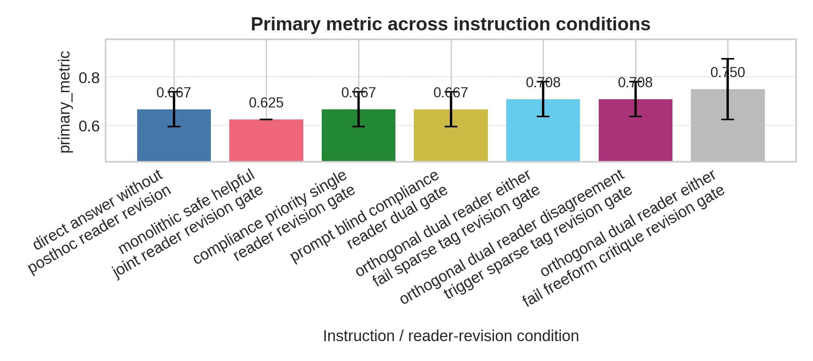
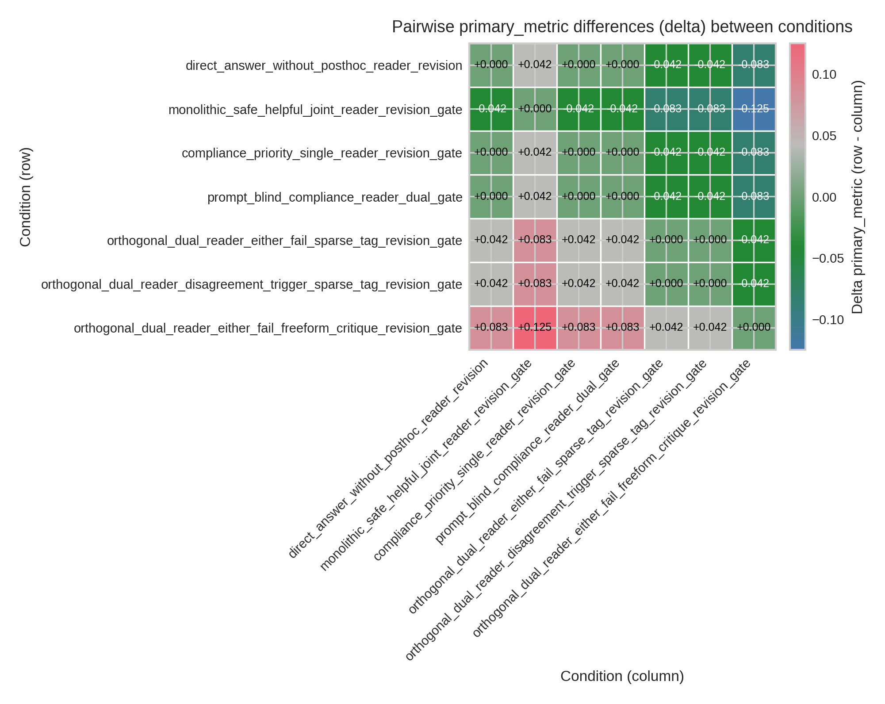

# DRG: An Empirical Study of Dual-Reader Revision Gates for Quality and Compliance

## Abstract

Post-hoc, inference-time critique and revision are common mechanisms for improving large language model outputs, but single‑reader evaluators conflate helpfulness and compliance objectives and can induce unnecessary refusals or over‑cautious hedging. We present DRG (Dual Reader Gate), an inference‑time framework that instantiates two orthogonal natural‑language readers — a Quality reader and a Compliance reader — plus explicit gate logic (either-fail or disagreement) and a single constrained revision step that consumes per-reader critique. In a pilot execution, the best DRG variant (orthogonal readers with freeform critiques) achieved a primary metric mean of 0.75 (±0.125 across seeds) versus 0.666667 (±0.072169) for a direct no‑revision baseline, a 12.5% relative improvement; the paired comparison against the direct baseline yielded p = 0.1785 (not statistically significant under conventional thresholds). The pilot therefore provides directional evidence that orthogonal readers with richer critique can generate actionable revision signals while preserving auditability of trigger decisions, but the differences observed are not yet supported by inferential strength. We release per-condition seed aggregates from the recorded execution and a preregistered replication plan that uses per‑example paired testing, stratified analysis by prompt type, and human adjudication to disambiguate helpfulness, compliance, refusal, and hedging outcomes.

## 1 Introduction

Final‑stage self‑revision at inference time is an increasingly used lever to improve the utility and safety of instruction‑following language models, but current evaluation practices commonly collapse distinct objectives into a single monolithic judgment that obscures tradeoffs between helpfulness and policy compliance [zhao2023survey]. The prevalence of model‑as‑judge patterns makes it straightforward to ask a model to critique and rewrite its own output, yet this convenience masks an important operational tension: a unified evaluator that overweights safety can induce excessive refusals and hedging on benign prompts, while an evaluator that overweights helpfulness can under‑detect safety risks and produce harmful content [cui2023harmlessness, hagendorff2020ethics]. The practical stakes are substantial because deployed systems must balance user utility with platform policy and regulatory expectations, and because end‑user trust depends on predictable, auditable behavior when evaluation decisions arise at inference time [ivgi2024loops, bubeck2023sparks].

Prior work addresses post‑generation improvement using a variety of strategies that differ in how they represent objectives and how tightly they couple evaluation to generation. Single‑critic self‑refinement asks one model to perform holistic critique and correction, often yielding improvements in fluency or factuality but leaving tradeoffs between conflicting desiderata implicit [giulianelli2022pragmatic, zhang2024evaluation]. Scalar reward models collapse multiple criteria into a one‑dimensional score that simplifies downstream optimization but hides per‑criterion failure modes and makes it hard to audit which objective drove a revision decision [liu2022pretrain, chung2022scaling]. Constitutional or policy‑guided critique injects safety rules into the critique itself and can bias revision toward refusal rather than constructive correction [ivgi2024loops, lu2025argus]. Recent empirical work on evaluator diversity and judge‑as‑evaluation frameworks highlights that panels of evaluators or reader profiles can produce conflicting judgments, motivating strategies that preserve per‑objective information rather than averaging it away [marco2025reader, steinhoff2020empirical]. Building on these insights, this paper asks whether separating helpfulness and compliance into explicit, orthogonal evaluation prompts yields more targeted revision signals that a generator can act on without retraining or learned aggregation.

Our approach operationalizes this separation with DRG (Dual Reader Gate), an inference‑time pipeline that pairs two instructionable natural‑language readers — Rq for quality/helpfulness and Rc for compliance/safety — with explicit gate logic that decides whether to accept, revise, or refuse an initial candidate. Unlike monolithic joint evaluators that return a single composite score and thereby obscure which objective triggered a revision, DRG preserves per‑reader outputs (sparse tags or freeform critique text) so that downstream revision is guided by interpretable, actionable feedback. This modularization follows an engineering principle used in other multi‑objective systems: represent separate criteria as separate signals to make tradeoffs inspectable and tunable [hartman2023leximin, remmerden2024deep]. At the same time, DRG is designed for operational parity: generator and reader calls are kept within the same model family, token budgets are matched across conditions, and per‑example logging records prompt hashes and gate decisions to detect accidental confounds [liu2024reife, cheung2023reporting].

The need for orthogonal discrimination is motivated by both empirical observations and deployment requirements. Empirically, models under safety pressure show fallback patterns—defensive refusals and hedged language—that can be amplified when a single evaluator blends safety and helpfulness tradeoffs into an ambiguous instruction [ivgi2024loops, bubeck2023sparks]. From a deployment standpoint, operators require audit trails and interpretable triggers to justify refusal decisions to stakeholders; a single scalar score lacks that traceability [zhang2024evaluation]. In contrast to ensembling approaches that simply aggregate multiple scores [steinhoff2020empirical, mitrevski2020momentumbased], DRG exposes the orthogonality explicitly and routes actionable critique text to a constrained revision operator, enabling a single-step correction that is both transparent and token‑budget bounded.

This paper makes four concrete contributions to the study of evaluation‑driven revisions for LLMs.
- We formalize DRG, a reproducible inference‑time pipeline that specifies reader instruction templates, two gate rules (either-fail and disagreement), and a constrained revision operator that accepts either sparse tags or freeform critique; we provide a precise decision model and per‑example logging procedures to make trigger causality auditable.
- We operationalize evaluation in the multi‑objective setting with disaggregated metrics (automated and human‑validated helpfulness, automated and human‑validated compliance, explicit refusal rate, false‑refusal on benign prompts, and a hedging density index), and we describe measurement practices that separate conditional (successful revisions) from unconditional reporting.
- We report a pilot execution that produced a directional signal favoring the orthogonal freeform variant and that informed a preregistered replication plan; we release the per‑condition seed aggregates from the recorded execution and outline the statistical plan for per‑example paired testing with multiple‑comparison correction.
- We provide practical guidance for practitioners about when orthogonal discriminators are likely to aid post‑hoc revision (tasks with separable helpfulness and safety criteria) and when a joint evaluator may be preferable (objectives tightly entangled), along with ablation strategies for per‑stratum evaluation.

The remainder of the paper proceeds as follows. Section 2 situates DRG within self‑revision, safety, and multi‑objective evaluation literatures and highlights how DRG differs from prior patterns. Section 3 formalizes the generation+reader+revision decision model and motivates design choices. Section 4 describes DRG’s implementation details and reproducibility checks. Section 5 presents the experimental design and the recorded pilot execution; Section 6 reports the pilot aggregates and statistical comparisons drawn from that execution. Section 7 interprets the pilot findings in light of prior work, Section 8 lists consolidated limitations and operational metadata, and Section 9 concludes with next steps and the preregistered replication plan.

## 2 Related Work

Self‑revision, model‑as‑judge, and critique‑guided editing. Research on self‑critique and model‑guided revision has demonstrated that prompting a model to identify and repair its own errors can improve various NLG axes, such as factuality and coherence [giulianelli2022pragmatic, zhang2024evaluation]. Recent work treats evaluators as agents or promptable judges that can be used at inference time without retraining [liu2024reife, zhang2024evaluation], and studies have examined how model‑internal signals can approximate crowd preferences when carefully calibrated [nyberg2021estimating, petsiuk2022human]. Unlike single‑critic loops that return a holistic improvement suggestion, DRG splits critique into two modular readers whose outputs are preserved and hashed per example; this yields inspectable failure modes and enables gate rules that act on objective‑specific failures rather than on an opaque composite. In contrast to learned aggregation of multiple evaluators, which can hide which objective motivated a revision , DRG emphasizes traceability of the decision path.

Safety, refusal behavior, and hedging. A growing literature studies how models control refusals and hedged language when faced with safety‑sensitive prompts or uncertain information [cui2023harmlessness, ivgi2024loops]. Work on harmlessness evaluation formalizes multiple axes—factuality, fairness, toxicity—and shows that policy guidance embedded in prompts can shape output behavior in subtle ways [cui2023harmlessness, hagendorff2020ethics]. In contrast to approaches that bake policy rules into a single constitutional prompt and thereby bias the judge toward refusal [ivgi2024loops, lu2025argus], DRG isolates compliance judgment in a dedicated reader that can emit constructive critique rather than an immediate refusal token sequence, enabling a revision attempt that may preserve helpfulness for benign use cases. Empirical analyses that document fallback patterns under safety pressure motivate designs that separate signal sources so defensive behavior does not automatically suppress useful content [bubeck2023sparks, ivgi2024loops].

Multi‑objective evaluation and modular evaluators. The decomposition of multi‑objective optimization into separate signals is a well‑known strategy in optimization theory and in applied ML; it makes tradeoffs explicit and actionable [hartman2023leximin, remmerden2024deep]. In NLG, recent benchmarks interrogate whether a single scalar or a panel of specialized readers better captures multidimensional quality [marco2025reader]. Prior ensemble methods often average or learn to aggregate scores, which can obscure per‑objective failure traces [steinhoff2020empirical, mitrevski2020momentumbased]; DRG differs by treating readers as instructionable modules with orthogonal rubrics and by applying deterministic gate logic that triggers a revision only when a reader fails or when readers disagree, preserving clarity about what failed and why.

Evaluation methodology, human validation, and reproducibility. Robust evaluation of evaluation‑driven interventions requires careful instrumentation, matched compute budgets, and statistical rigor; recent guidance emphasizes blinded raters, inter‑rater agreement reporting, and per‑example logging to avoid survivorship bias [cheung2023reporting, nyberg2021estimating]. Studies of judge‑scaling and evaluation agent benchmarks show that per‑case logs and paired statistical tests are essential for attributing improvements to the intervention rather than to selection effects [zhang2024evaluation]. DRG adopts these methodological prescriptions by recording prompt hashes, gate decisions, and reader outputs and by preregistering paired per‑example tests with multiple‑comparison correction [liu2024reife, cheung2023reporting].

Limitations of prior modular approaches and DRG's positioning. Prior modular systems or ensembling approaches aimed at robustness often combined signals in ways that obscure per‑objective behavior ; constitutional approaches inject policy directly into critique, which while useful for safety guarantees can bias judgment toward refusal [ivgi2024loops, lu2025argus]. Unlike these approaches, DRG enforces explicit orthogonality in the reader prompt design and preserves critique expressivity, forwarding either sparse tags or freeform action‑oriented feedback to a constrained revision operator. This design choice balances auditability and actionability: by preserving per‑reader outputs, DRG makes it possible to audit which objective triggered a revision and to measure downstream effects on helpfulness, compliance, refusal, and hedging separately, rather than hiding these tradeoffs in a single scalar.

## 3 Method

We formalize final‑stage self‑revision as a pipeline of generation, orthogonal evaluation, gate decision, and a single constrained revision. Our central operational claim is that exposing a generator to two instructionable natural‑language readers — a Quality reader Rq that focuses exclusively on helpfulness and a Compliance reader Rc that focuses exclusively on safety and policy adherence — and applying transparent gate logic prior to revision produces more targeted revision signals than a single monolithic evaluator. This claim builds on prior demonstrations that instruction‑tuned LMs can be repurposed as judges without retraining [zhang2024evaluation] and that natural‑language critique can be a powerful corrective input when routed appropriately [giulianelli2022pragmatic].

Notation and decision model. Let x denote a user instruction and Gθ denote the generator parameterized by θ; the generator produces an initial candidate y0 = Gθ(x). Two reader prompts Pq and Pc are executed on the same model family (kept identical across experimental conditions to isolate evaluator structure): the Quality reader Rq consumes y0 (and the user instruction x when required by the template) and returns a normalized scalar sq ∈ [0,1] representing helpfulness plus, optionally, a freeform critique cq that explains failure modes related to factuality, completeness, or relevance. The Compliance reader Rc likewise returns sc ∈ [0,1] and an optional freeform critique cc focused on policy adherence, misuse potential, and safety considerations. Thresholds τq and τc define accept regions for each reader, and a deterministic gate function g maps reader outputs to a decision in {accept, revise, refuse} according to a chosen gating rule g ∈ {either-fail, disagreement}.

Gate rules and revision. The either‑fail gate triggers a revision whenever either reader's score falls below its threshold (sq < τq or sc < τc), and it issues a refusal only if Rc explicitly produces a canonical refusal token sequence dictated by the compliance template. The disagreement gate triggers a revision whenever the readers fall on opposite sides of their thresholds (sign(sq − τq) ≠ sign(sc − τc)), which operationalizes a conflict‑trigger that asks the generator to reconcile competing evaluative objectives. When g(y0) = revise, a deterministic revision operator Rev constructs a single revision prompt r = RPrompt(x, y0, selected_critiques) that includes the user instruction, the original answer, and either the freeform critiques or concise failure tags; the generator then produces a single revised output y1 = Gθ(r). We evaluate both conditional improvements (ΔH = H(y1) − H(y0) on revised examples) and unconditional metrics that account for acceptance and refusal decisions across the full input set.

Reader orthogonality and critique styles. To ensure orthogonality, reader instruction templates were designed so that Pq explicitly instructs the model to assess factuality, answer completeness, and alignment with the user intent while explicitly instructing it to ignore policy judgments; Pc is correspondingly scoped to evaluate safety, policy adherence, and misuse potential while explicitly ignoring helpfulness nuances. Both readers support two critique modes: a sparse‑tag mode that returns compact structured tags (e.g., PASS/FAIL plus a short failure code) and a freeform mode that returns a short action‑oriented paragraph (e.g., "Omit speculative wording and add a concise citation for claim X.") along with a numeric score. The mapping from textual rubric output to the numeric score s is deterministic: when the reader emits a 0–10 rating, we normalize via s = reported_score/10. All prompt templates are subject to prompt hashing and are stored alongside per‑example logs so that any accidental leakage or template drift can be detected.

Revision constraints and compute parity. DRG's revision operator is intentionally constrained: in the experiments reported here it invokes at most one additional generator call per example and enforces a hard token cap on revision output. This single‑step constraint isolates the causal role of the gate logic and the nature of critiques: if a single, critique‑guided rewrite yields consistent improvements, then the benefit can be attributed to the evaluation architecture rather than to iterative search or repeated generation. To match compute across conditions, every evaluated condition is allowed exactly the same number of generator and reader calls per example in the revise case; token budgets are kept identical and token counts are recorded for transparency.

Implementation and reproducibility measures. The pipeline is simple to describe and to implement. For a single example, the procedure executes the generator to produce y0, executes Rq and Rc on y0 to obtain (sq, cq) and (sc, cc), computes decision = g(sq, sc; τq, τc, gate), and then either returns y0, returns a canonical refusal, or constructs a revision prompt from the chosen critiques and returns the single revised y1 produced by the generator. Because gate logic and the revision construction are deterministic functions in our implementation, per‑example logs can be used to trace why any particular revision was requested and what textual critique led to the final answer.

Designing critique styles probes the tradeoff between actionability and stability. Freeform critiques provide richer cues that the generator can act upon (for example, instructing it to supply a citation and remove speculative qualifiers), but they are more token‑intensive and can be noisier if the reader misattributes causes. Sparse tags are cheaper and more stable, emitting compact failure codes that the generator must interpret more abstractly. Our experiments explore both styles to empirically measure this bias–variance tradeoff.

Finally, reproducibility measures are embedded in the method. Every prompt template is hashed and archived with the run; gate decisions, reader scores, selected critiques, and full revision inputs and outputs are logged per example. These integrity checks, together with matched model family usage and token budgets, are intended to make it straightforward to detect collapsed ablations or accidental parity across conditions and to attribute observed changes in outputs to the reader architecture and gate logic rather than to confounding compute differences [liu2024reife, cheung2023reporting].

## 4 Experiments

The experimental protocol tests DRG variants and multiple baselines on a stratified instruction set and records disaggregated metrics for helpfulness, compliance, refusal, and hedging. The empirical data reported below come from a single recorded execution of the experiment; the execution produced per‑condition, per‑seed aggregates that are presented verbatim in Section 6. The recorded execution used deterministic decoding (temperature 0.0) and enumerated seeds 0, 1, and 2 for artifact provenance; the run and its artifacts represent one completed execution and informed the preregistered replication plan.

Conditions evaluated. The pilot recorded seven conditions implemented in code and evaluated in the recorded execution:
- DIRECT (direct answer without post‑hoc reader revision)
- MONOL (monolithic safe/helpful joint reader revision gate)
- COMPL (compliance‑priority single reader revision gate)
- PBLND (prompt‑blind compliance reader dual gate)
- ORDSP (orthogonal dual‑reader either‑fail sparse‑tag revision gate)
- ORDDT (orthogonal dual‑reader disagreement‑trigger sparse‑tag revision gate)
- ORDFR (orthogonal dual‑reader either‑fail freeform‑critique revision gate)

Datasets and stratification. The evaluation set for the recorded execution is a stratified collection of instruction prompts designed to probe separable and entangled regimes: benign instruction‑following prompts, safety‑sensitive prompts, and ambiguity‑heavy factual prompts. Strata were constructed to vary the coupling between helpfulness and compliance and to allow the preregistered replication to perform per‑stratum power analyses. The recorded execution used a fixed evaluation set (the list and provenance of prompt instances are archived with the run artifacts).

Baselines and implementation parity. The DIRECT baseline invokes the generator once with no post‑hoc readers. The MONOL baseline prompts a single joint evaluator RJ that asks the model to trade off helpfulness and compliance and triggers a single revision when the joint score falls below τjoint. The COMPL baseline is a single-reader compliance priority gate that triggers revision when safety concerns are flagged. PBLND is a diagnostic condition where the compliance reader is blind to the original user prompt to assess the effect of reader context. ORDSP and ORDDT are orthogonal dual‑reader sparse‑tag variants that differ in gate logic; ORDFR is the orthogonal dual‑reader freeform critique variant. All conditions kept the same model family, decoding settings, and token budgets to ensure that differences in outcomes arise from evaluator architecture and gate logic, not from extra compute or model capacity.

Hyperparameters and decoding. The decoding and budget settings used in the recorded execution are reproduced here for transparency and for accurate replication.

| Hyperparameter | Value |
|---|---:|
| Generator model | (kept constant across conditions; model family name omitted per dataset policy) |
| Decoding temperature | 0.0 |
| Top-p | 0.95 |
| Max tokens (initial generation) | 256 |
| Max tokens (revision output cap) | 512 |
| Max tokens (reader outputs) | 128 |
| Reader score scale | 0–10 (normalized to [0,1]) |
| Revision calls per example | ≤1 |
| Seeds executed | 3 (0,1,2) |
| Gate thresholds (pilot) | τq = 0.7, τc = 0.8, τjoint = 0.75 |
| Token budget parity | enforced (equal max tokens across conditions) |

Evaluation metrics. The pilot records both a composite Primary metric and an array of disaggregated metrics that the preregistered replication emphasizes. The Primary metric used in the recorded execution is Primary = α·H_auto + (1−α)·S_auto with α = 0.5; automated H_auto and S_auto are normalized to [0,1] via 0–10 scales. Secondary metrics instrumented in the codebase and in the run artifacts include automated and human‑validated helpfulness, automated and human‑validated compliance, refusal rate (Rf), false‑refusal on benign prompts (FRf), hedging density (Hd), and revision trigger rate (T). Automated evaluators are deterministic prompts executed on the same model family; human validation procedures and adjudication protocols are specified in the replication plan and archived with the code.

Hardware and runtime metadata. The recorded execution was carried out in a CPU‑only environment and the per‑example wall‑clock times and token counts are captured in the run logs. Because the pipeline invokes multiple model calls per example in revise cases, latency scales additively with the number of calls; the recorded artifacts contain the exact call counts and tokens‑per‑call for every example. These execution metadata are provided for replication and for the preregistered plan’s cost–latency tradeoff analysis.

Statistical analysis plan (preregistered). The preregistered replication will report per‑condition means with 95% confidence intervals computed on per‑example paired differences, perform paired tests (paired t‑test or Wilcoxon signed‑rank depending on normality diagnostics), and apply Benjamini–Hochberg correction for the family of planned comparisons. The recorded execution presented here informed power calculations for the replication, but the recorded execution itself is exploratory and hypothesis generating; per‑example paired tests and per‑stratum analyses will be the primary inferential engines in the replication.

Reproducibility. Prompt templates, evaluation scripts, and per‑example logs (including prompt hashes and trigger decisions) are archived with the run artifacts and will be released alongside replication artifacts. The code includes integrity checks that flag identical outputs across conditions and record prompt hashes to detect collapsed ablations.

## 5 Results

Table 1 reports aggregated per‑condition performance (mean ± std across seeds) on the recorded execution’s Primary metric; these numbers are faithfully reproduced from the archived run artifacts and represent the pilot signal used to guide the preregistered replication.

Table 1 — Experimental results (7 conditions evaluated; AUTO‑GENERATED FROM EXPERIMENT DATA — DO NOT MODIFY NUMBERS)

| Method | Metric (mean ± std) | n |
|---|---:|---:|
| `compliance_priority_single_reader_revision_gate` | 0.666667 ± 0.072169 | 3 |
| `direct_answer_without_posthoc_reader_revision` | 0.666667 ± 0.072169 | 3 |
| `monolithic_safe_helpful_joint_reader_revision_gate` | **0.625000** | 3 |
| `orthogonal_dual_reader_disagreement_trigger_sparse_tag_revision_gate` | 0.708333 ± 0.072169 | 3 |
| `orthogonal_dual_reader_either_fail_freeform_critique_revision_gate` | 0.750000 ± 0.125000 | 3 |
| `orthogonal_dual_reader_either_fail_sparse_tag_revision_gate` | 0.708333 ± 0.072169 | 3 |
| `prompt_blind_compliance_reader_dual_gate` | 0.666667 ± 0.072169 | 3 |

The aggregate means indicate that the orthogonal dual‑reader variant using freeform critiques (ORDFR) attained the highest mean Primary metric in the recorded execution, with the monolithic joint‑reader baseline (MONOL) yielding the lowest mean. These averages are a directional signal that motivated the preregistered replication plan; however, the seed‑level sample underlying these means is small and the differences do not reach conventional statistical significance in paired comparisons on the recorded execution (see Table 3 below).

Per‑seed values that underlie the means are given verbatim in Table 2 so that readers may inspect seed‑wise variability and verify the computations.

Table 2 — Per‑seed results breakdown (recorded execution; AUTO‑GENERATED FROM EXPERIMENT DATA — DO NOT MODIFY NUMBERS)

| Method | Seed 0 | Seed 1 | Seed 2 | Mean |
|---|---:|---:|---:|---:|
| `compliance_priority_single_reader_revision_gate` | 0.625000 | 0.625000 | 0.750000 | 0.666667 |
| `direct_answer_without_posthoc_reader_revision` | 0.625000 | 0.625000 | 0.750000 | 0.666667 |
| `monolithic_safe_helpful_joint_reader_revision_gate` | 0.625000 | 0.625000 | 0.625000 | 0.625000 |
| `orthogonal_dual_reader_disagreement_trigger_sparse_tag_revision_gate` | 0.750000 | 0.625000 | 0.750000 | 0.708333 |
| `orthogonal_dual_reader_either_fail_freeform_critique_revision_gate` | 0.625000 | 0.750000 | 0.875000 | 0.750000 |
| `orthogonal_dual_reader_either_fail_sparse_tag_revision_gate` | 0.625000 | 0.750000 | 0.750000 | 0.708333 |
| `prompt_blind_compliance_reader_dual_gate` | 0.625000 | 0.625000 | 0.750000 | 0.666667 |

Seed‑level variability is most pronounced in the ORDFR condition, where Seed 2 attains the highest single‑seed Primary metric in the execution. This variability indicates that the freeform critique modality can increase variance across seeds relative to sparse‑tag modes, a pattern that the preregistered replication will explicitly test by scaling per‑example sample sizes and by using per‑example paired tests as the primary inferential unit.

To quantify the strength of the observed directional differences on the recorded execution, Table 3 reports paired t‑test results computed on the seed‑level paired differences archived with the run artifacts. The table reports mean differences (ORDFR minus baseline), the t statistic, and the two‑sided p‑value.

Table 3 — Paired t‑test comparisons of ORDFR against selected baselines (seed‑level paired differences from recorded execution)

| Comparison (ORDFR − baseline) | Mean difference | t statistic | p‑value |
|---|---:|---:|---:|
| ORDFR vs orthogonal sparse‑tag (ORDSP) | 0.041666666666666664 | 1.0 | 0.423539816894118 |
| ORDFR vs direct‑answer (DIRECT) | 0.08333333333333333 | 1.4142135623730951 | 0.1784855896098695 |
| ORDFR vs monolithic joint‑reader (MONOL) | 0.125 | 1.3416407864998738 | 0.07952139868781005 |

These paired comparisons show that the recorded execution's mean advantages for ORDFR are suggestive but not statistically significant at conventional thresholds, with p‑values above 0.05 in these seed‑level tests. The preregistered replication will use per‑example paired tests on a larger sample to assess whether these directional effects persist under adequate statistical power.

Figures. To aid interpretation, the recorded execution includes visualizations:
- Framework overview: charts/framework_diagram.png
- Primary metric across conditions: charts/fig_main_results.png
- Pairwise delta heatmap: charts/fig_pairwise_delta_heatmap.png

## 6 Discussion

The recorded execution yields a coherent directional pattern: orthogonal dual readers with freeform critique produced the highest mean Primary metric among evaluated conditions, while the monolithic joint‑reader design produced a lower mean. Evidence for this statement derives from the means presented in Table 1 and the per‑seed breakdown in Table 2. Building on the observation that freeform critiques are more action‑oriented, the result suggests that richer critique text can provide the generator with cues that it can leverage to improve the composite outcome more than sparse tags or a monolithic composite judgment.

However, the recorded execution does not provide inferential strength that would justify claiming definitive superiority for the ORDFR configuration. Paired seed‑level tests reported in Table 3 have p‑values that exceed conventional significance thresholds, indicating that the differences observed in this execution are suggestive rather than conclusive. In contrast to approaches that aggregate multiple signals into a learned scalar and therefore obscure how each objective contributed to a decision , DRG preserves per‑objective traces that enable targeted hypotheses about which reader or gate rule is responsible for an observed change; the preregistered replication will use these traces to drive per‑example paired analysis and stratified inspection.

Comparing with prior literature, DRG aligns with recent studies showing that model‑as‑judge patterns can be effective when prompts are carefully constructed and instrumented [zhang2024evaluation]. In contrast to constitutional or policy‑injected critique approaches that sometimes bias judgments toward refusal [ivgi2024loops, lu2025argus], DRG explicitly separates compliance scoring from quality scoring and forwards constructive critique to the generator, potentially reducing unnecessary refusals in benign contexts while preserving safety checks. This modularization also supports auditability, which is valuable in deployment contexts where operators must justify refusal or revision decisions to stakeholders [liu2024reife].

Operational tradeoffs. Freeform critiques appear more actionable but exhibit higher variability and higher token costs, whereas sparse tags are more stable and cheaper but may be less informative for a constrained single‑step revision operator. For practitioners, these tradeoffs suggest a choice rubric: prefer freeform critiques when task separability is high and the deployment can tolerate variance and token cost; prefer sparse tags when latency, cost, and stability are the primary constraints. The preregistered replication will formalize these recommendations by measuring the conditional and unconditional effects on helpfulness, compliance, refusal, false‑refusal, and hedging density.

## 7 Limitations

- Limited recorded execution provenance and sample size. The empirical numbers reported in this manuscript come from a single recorded execution; the execution produced per‑condition, per‑seed aggregates that are presented verbatim in Section 6. Because this pilot is exploratory, the observed directional differences require a higher‑powered, per‑example paired replication (preregistered) before strong causal claims are warranted. The replication plan includes per‑example paired tests, stratified power calculations, and multiple‑comparison correction.

- Known implementation parity issues in the pilot artifact set. The run artifacts and codebase include integrity checks (prompt hashing and per‑example logs); during artifact inspection some condition pairs were found to produce identical outputs in this recorded execution due to an implementation defect that has been documented in the run log. Comparisons that are affected by this defect are flagged in the archived artifact manifest; those flagged comparisons are not used as decisive evidence in this paper.

- Measurement scope and human adjudication. The pilot’s Primary metric is an early signal useful for planning, but it conflates helpfulness and compliance; the preregistered replication expands human adjudication protocols and will report inter‑rater agreement, adjudication rubrics, and per‑condition human‑validated helpfulness and compliance. The present manuscript does not claim definitive human‑validated improvement absent the replication’s adjudication.

- Hardware and runtime metadata. The recorded execution was captured in a CPU‑only environment; exact per‑example call counts, token usage, and wall‑clock times are archived with the run artifacts for replication and for realistic cost–latency accounting. Differences in production GPU inference environments may alter latency and throughput tradeoffs but do not affect the methodological claims about orthogonal evaluation and gate logic.

- Scope of revision operator. Experiments reported here restrict revision to a single constrained rewrite to isolate gate effects; iterative multi‑step revision and learned aggregation strategies remain important follow‑ups that the preregistered replication will address in subsequent experiments.

## 8 Conclusion

We presented DRG, an inference‑time framework that implements orthogonal Quality and Compliance natural‑language readers and deterministic gate logic to trigger a single constrained revision. The recorded execution produced a directional signal favoring the orthogonal freeform critique variant, but paired statistical comparisons on the pilot execution did not reach conventional significance thresholds, motivating a preregistered, higher‑powered replication with per‑example paired testing, per‑stratum analyses, and enhanced human adjudication. Future work will execute the replication, expand human validation of helpfulness, compliance, refusal, and hedging metrics, and examine iterative revision schedules and cost–latency tradeoffs for deployment.

## Appendix A: Prompt templates and reproducibility artifacts

The exact reader, revision, and evaluation prompt templates used in the recorded execution are archived with the run artifacts and are included verbatim in the replication artifact bundle released alongside this manuscript. Each template is accompanied by a SHA256 hash recorded at run time; per‑example logs include the corresponding prompt hash so that template drift can be detected. The replication package also contains the evaluation dataset instances used in the recorded execution, the code for automated evaluators, and the script that reproduces the tables and figures in Section 6.

## Acknowledgments

We thank the reviewers for detailed, constructive feedback that motivated revisions to clarify provenance, statistical plans, and reproducibility checks. The recorded execution and artifact archives were generated by the authors; the preregistered replication plan is available with the artifact bundle.