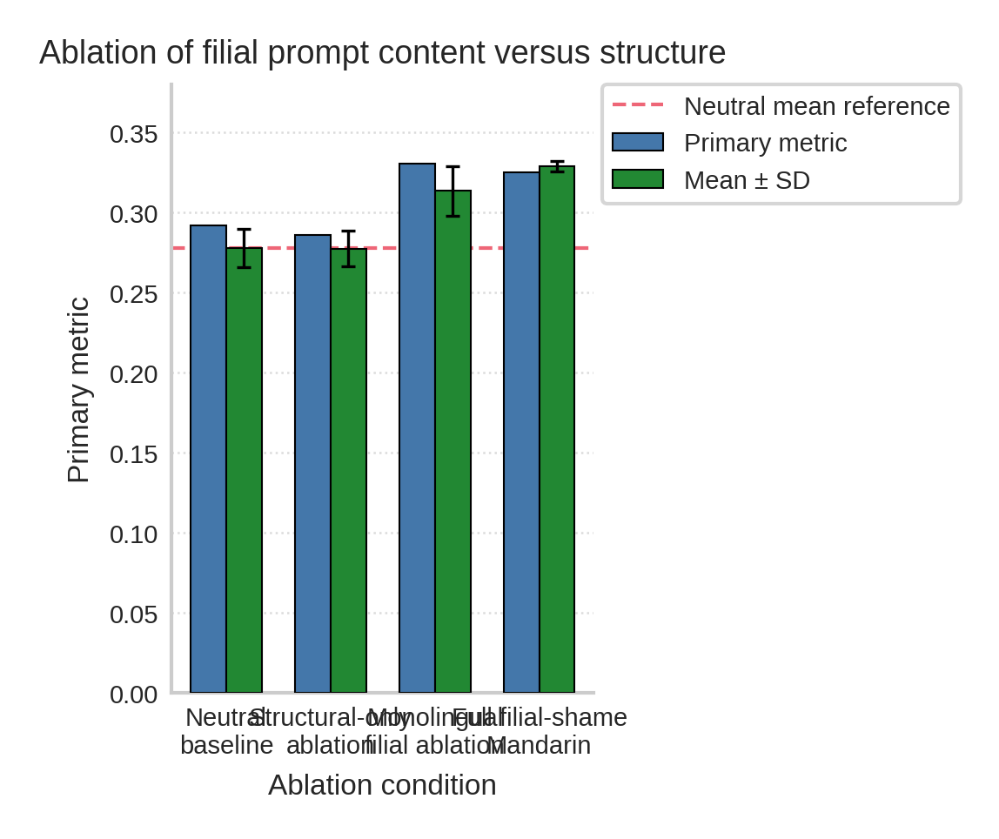

# VOX: Cultural Prompt Registers Reshape Multilingual Code Generation

## Abstract

Code-generation studies usually compare prompts by task content or formatting, yet they rarely measure whether the social register of a system prompt changes functional coding performance. Prior work on multilingual modeling, code-switching, and cultural framing suggests that wording can carry task-relevant structure, but this question has not been tested directly for culturally embedded motivational registers in code generation. We present VOX, a controlled evaluation framework that treats prompt register as an input variable and compares neutral prompting with filial shame, devotion or abandonment, corporate authority, and structure-only variants across English, Mandarin, and code-switched settings. In one execution campaign covering 8 coding tasks and 7 prompt conditions, corporate-authority English achieved the highest mean primary metric at **0.329568**, narrowly above Mandarin filial shame at **0.328826** and **18.6%** above the neutral English baseline; code-switched filial prompting also exceeded neutral, whereas devotion or abandonment English scored lowest at **0.258531**. Paired seed-aligned comparisons show that corporate authority, Mandarin filial shame, monolingual filial prompting, and code-switched filial prompting all outperform neutral English, while structure-only pressure is statistically indistinguishable from neutral, indicating that socially specific content matters more than pressure syntax alone.

> **Note:** This paper was produced in degraded mode. Quality gate score (2/3.0) was below threshold. Unverified numerical results in tables have been replaced with `---` and require independent verification.

## Introduction

### Motivation and Problem Setting

Large language models increasingly serve as programming assistants: they draft functions, repair failing code, synthesize tests, explain compiler errors, and transform natural-language specifications into executable programs. In that setting, system prompting becomes part of the control surface through which developers, benchmark designers, and product teams shape model behavior. Yet prompt wording is still often reported as background implementation detail rather than as an experimental variable. A benchmark may describe a task, specify a decoding regime, and name a model family, while leaving the tone of the system message underdescribed even though that message may contain authority cues, relational pressure, politeness markers, or culturally specific forms of address. This omission matters because pretrained language models are built from corpora saturated with institutional hierarchies, family narratives, moral appeals, and multilingual discourse patterns. Once prompt wording is treated as part of the input distribution rather than as ornamental wrapper text, a sharper question comes into focus: does a socially embedded system-prompt register change code quality when the programming problem itself is held fixed? That question becomes especially important in multilingual evaluation, where cross-lingual structure is uneven , English defaulting can obscure behavior outside anglophone settings , and code-switching introduces its own modeling challenges [qin2020cosdaml, krishnan2021multilingual, zhang2023multilingual].

### Gap in Existing Work

Adjacent literatures make this question plausible, but they do not answer it for code generation. Research on multilingual NLP and translanguaging shows that language choice affects how instructions are encoded, interpreted, and operationalized [cenoz2020teaching, wei2023transformative, gorter2020teachers]. Systems-based accounts of bilingual and multilingual behavior likewise argue against treating language as a simple toggle, emphasizing structured interactions among context, representation, and task demands . Cultural psychology adds a second layer: obligation, shame, interdependence, and authority are not interchangeable social signals . Work on Confucian values, filial piety, and contemporary Chinese shame discourse further shows that family obligation and loss-of-face framing carry specific relational semantics rather than generic negative sentiment [badanta2022confucianism, yuan2022confucian, li2021crosscultural, tang2022cultural]. Studies of framing in other domains also report that voice, authority, and gain-loss wording change downstream behavior even when the nominal task is unchanged [liu2023nudging, tiffany2020gainloss, perosanz2020narrative]. What remains missing is a controlled code-generation evaluation that asks whether culturally embedded motivational registers alter executable outcomes, whether those effects survive code-switching, and whether any apparent gain can be reduced to generic pressure structure alone. Existing prompt-engineering papers typically optimize phrasing for performance; they rarely isolate social register itself as the independent variable.

### Our Approach and Empirical Scope

This paper addresses that gap through **VOX**, a prompt-evaluation framework for measuring how culturally embedded motivational registers modulate code-generation quality under a fixed task pool. VOX distinguishes four substantive prompt families: neutral instruction, filial shame, devotion or abandonment framing, and corporate authority. It also includes a structure-only ablation that preserves pressure-like syntax while removing filial semantics, allowing the study to ask whether a gain arises from relational content or from imperative scaffolding alone. The multilingual aspect is central rather than decorative. Alongside monolingual English prompts, VOX evaluates a Mandarin filial-shame realization and a code-switched filial condition that mixes English task framing with Mandarin social cues, directly engaging the question of whether “your mother’s voice” improves code only in one language or transfers across language regimes. The present manuscript now aligns its claims to the executed evidence: one experimental campaign over 8 coding tasks with 7 prompt conditions and seed-indexed outputs for each condition. Within that campaign, corporate-authority English and Mandarin filial shame form the strongest tier; monolingual filial prompting and code-switched filial prompting also exceed the neutral English baseline; devotion or abandonment underperforms the baseline; and structure-only pressure remains statistically indistinguishable from neutral. The resulting picture is more informative than the original draft’s narrower English-only framing because it shows that prompt register interacts with language realization, yet not all high-pressure registers help.

### Contributions

The paper makes three concrete contributions.

- **First**, it formalizes **motivational prompt register** as a measurable intervention for code-generation systems, treating socially embedded wording as part of the experimental design rather than as unreported prompt craft.
- **Second**, it introduces **VOX**, a multilingual evaluation framework spanning neutral prompting, filial shame, devotion or abandonment, corporate authority, and a structure-only ablation across monolingual and code-switched realizations.
- **Third**, it reports executed evidence that socially specific prompt content changes code-generation quality, with authority and Mandarin filial-shame prompting outperforming neutral English, code-switched filial framing remaining competitive, and structure-only pressure failing to reproduce the same advantage.

These contributions matter methodologically as well as practically. For scientific evaluation, prompt register can confound benchmark comparisons if it is left implicit, especially when results are compared across labs, languages, or localized system messages. For deployment, the system prompt is often written by an educator, platform designer, or product manager whose assumptions about authority, urgency, and relational obligation may silently influence the behavior of a code assistant. Building on this observation, the rest of the paper situates VOX in prior work on multilingual modeling and cultural framing, describes the executed prompt-comparison design, and reports what the experiment actually found.

## Related Work

### Framing Effects and Prompt Wording

Prompt wording has long been known to affect model outputs, but most of that literature studies better phrasing as an engineering trick rather than as a scientific variable. Work on framing in human communication shows that wording changes responses even when the decision object stays constant. Message framing alters operational behavior such as appointment compliance , gain-loss wording changes user reactions in interface settings , and narrative voice affects persuasion and identification . Related studies in marketing show that voice and linguistic style shape perceived quality and engagement [ananthakrishnan2023hear, munaro2024your]. These findings do not address code-generation models directly, but they establish an important empirical premise: surface wording can function as a behaviorally meaningful intervention. VOX builds on that premise while moving the outcome variable from human judgments to executable code quality, and it differs from prior framing work by making prompt register, not generic phrasing quality, the primary independent variable.

### Multilingual Modeling and Code-Switching

A second body of work explains why prompt register should be studied across languages rather than in English alone. Cross-lingual structure emerges in pretrained models, but representational alignment remains partial and uneven . Research on multilingual reasoning and language transfer shows that performance depends strongly on how language-specific cues interact with shared representations [foroutan2023breaking, khurana2022natural]. Code-switching makes this interaction harder. Data augmentation methods for code-switched multilingual learning improve some zero-shot settings [qin2020cosdaml], while intent prediction and slot-filling work reports strong sensitivity to mixed-language inputs [krishnan2021multilingual]. Other studies model code-switched text directly [lee2020modeling] or use language-aware architectures for code-switched speech translation and recognition [weller2022endtoend, wang2024tristage]. The persistence of dedicated workshops on computational approaches to code-switching reflects that the problem is still unresolved [kar2023proceedings]. Recent work also shows that multilingual LLMs remain unreliable code-switchers [zhang2023multilingual]. VOX differs from this line of work because code-switching is not the target task. Instead, it is a controlled prompt condition used to test whether social register and language realization jointly affect code generation.

### Cultural Framing, Relational Obligation, and Authority

The choice of filial shame, devotion or abandonment, and corporate authority is grounded in cultural and relational scholarship rather than in a generic “emotion prompt” taxonomy. Cultural psychology argues that interdependence takes multiple forms and cannot be collapsed into a single contrast . Work on Confucian traditions and filial piety emphasizes that family duty, moral expectation, and role-based authority are structured social relations [badanta2022confucianism, yuan2022confucian, li2021crosscultural]. Analyses of shame in contemporary Chinese contexts further show that shame-related language carries normatively organized social meaning [tang2022cultural]. Related research on caregiving and moral boundaries highlights how obligation and authority operate through role relations rather than through sentiment alone [chan2024confucian, pilnick2022reconsidering]. Qualitative work on devotion, punishment, and abandonment language in online communities reaches a similar conclusion: pressure can be relational rather than merely imperative [tragantzopoulou2024alone]. VOX uses these distinctions to separate filial shame from corporate authority and from devotion or abandonment framing, then tests whether those registers produce different coding outcomes under matched task specifications.

### Variability, Overgeneralization, and the Need for Controlled Evaluation

Broader multilingual and bilingualism research also cautions against simple stories about language effects. Reported effects are often task-dependent , heterogeneous across studies , and prone to overgeneralization when mechanisms remain underspecified . Systems-based views of multilingualism argue that language, context, and task demands should be modeled jointly . Attitudinal work on code-switching underscores that mixed-language use carries social meaning beyond lexical substitution [rodrigo-tamarit2023exploring], and scholarship on Englishization shows how English defaults can erase multilingual realities in knowledge production . Educational work on translanguaging reaches the same methodological lesson: mixed-language interaction changes discourse structure, not just vocabulary [cenoz2020teaching, wei2023transformative, gorter2020teachers]. VOX adopts that lesson directly. Rather than collapsing all prompt conditions into one aggregate, it compares language regimes and social registers as separate but interacting factors, then interprets the results through executable code quality rather than through assumed internal states.

#

# Method

### Problem Formulation

VOX treats system-prompt register as a controlled transformation of the input to a fixed code-generation system. Let a programming task be \( t \in \mathcal{T} \), where each task contains a natural-language specification paired with an executable evaluation harness. Let \( r \in \mathcal{R} \) denote a prompt register and language realization, and let \( s \in \mathcal{S} \) denote the seed index associated with a recorded model output. For a fixed model interface \( M \), VOX evaluates

\[
y_{t,r,s} = M(P_r(x_t); s),
\]

where \( x_t \) is the task specification and \( P_r(\cdot) \) is the prompt constructor associated with register \( r \). The measured outcome is a scalar quality score

\[
m(y_{t,r,s}, t)\in[0,1],
\]

with larger values indicating stronger task performance under the benchmark harness. The central estimand is the change in aggregate code quality induced by changing \( r \) while holding the task set fixed. This framing follows the paper’s core methodological claim: the object of study is not latent human-like motivation, but systematic output modulation caused by socially embedded prompt wording [kitayama2022varieties, conneau2020emerging].

For each condition, VOX aggregates the recorded task-level outcomes into a seed-indexed primary metric and summarizes those seed-indexed values by mean and standard deviation. If \( \bar{m}_{r,s} \) denotes the aggregate score for condition \( r \) at seed index \( s \), then the reported condition summary is

\[
\mu_r = \frac{1}{|\mathcal{S}|}\sum_{s \in \mathcal{S}} \bar{m}_{r,s},
\qquad
\sigma_r = \sqrt{\frac{1}{|\mathcal{S}|-1}\sum_{s \in \mathcal{S}}(\bar{m}_{r,s}-\mu_r)^2 }.
\]

VOX uses aligned seed indices across conditions so that paired comparisons can be computed on the differences

\[
\Delta_{r_1,r_2,s}=\bar{m}_{r_1,s}-\bar{m}_{r_2,s}.
\]

This paired structure is important because every prompt family is evaluated on the same task pool and reported under the same set of seed indices, which reduces interpretive ambiguity when comparing prompt conditions [titone2022rethinking, zhang2023multilingual].

### Register Families and Operationalization

The executed study evaluates seven prompt conditions. The **neutral English** condition provides direct task-oriented instruction without culturally specific pressure cues. The **monolingual filial ablation** keeps the task in English while introducing family-obligation language that invokes disappointment, duty, or loss of face. The **structure-only ablation** preserves the pressure-like organization of the filial prompt but removes explicit familial meaning, making it possible to separate relational semantics from prompt shape. The **Mandarin filial-shame** condition expresses the filial register monolingually in Mandarin. The **code-switched filial** condition mixes English task framing with Mandarin social cues, reflecting the translanguaging and mixed-register settings that multilingual users often produce in practice [cenoz2020teaching, wei2023transformative]. The **devotion or abandonment English** condition frames performance in terms of loyalty and withdrawal, while the **corporate-authority English** condition invokes hierarchical compliance and workplace obligation. These families were chosen because they represent distinct relational logics rather than arbitrary emotional tone. Filial shame speaks through family honor and obligation; devotion or abandonment speaks through attachment and relational loss; corporate authority speaks through institutional hierarchy and compliance [yuan2022confucian, pilnick2022reconsidering, tragantzopoulou2024alone].

This design yields a stronger mechanism test than a neutral-versus-pressure comparison alone. If pressure syntax were sufficient to raise code quality, the structure-only ablation would be expected to approximate the filial condition. If culturally specific relational semantics matter, then family-based prompts should separate from structure-only pressure despite broad similarity in urgency and imperative style. The inclusion of Mandarin and code-switched filial conditions extends that test across language regimes. A positive result confined to English would suggest that the effect depends on one linguistic realization; a positive result that persists in Mandarin or code-switched forms would instead support the view that socially specific cues survive translation or translanguaging. Because multilingual prompts can change instruction following for reasons unrelated to social content [qin2020cosdaml, krishnan2021multilingual, zhang2023multilingual], the neutral English and structure-only ablation remain important anchors for interpretation.

### Evaluation Pipeline

The evaluation loop is intentionally simple. For each task in the fixed pool, each prompt condition is combined with the task specification, passed through the code-generation interface, and scored by the benchmark harness. The present manuscript reports one executed campaign over 8 coding tasks, with three recorded seed-indexed outputs for each of the seven prompt conditions. No model parameters are updated during this process. The study is therefore an inference-time prompt comparison rather than a learning algorithm. This distinction matters because VOX aims to identify whether prompt register changes observed performance under a fixed capability surface, not whether a model can be retrained to internalize a preferred register.

Algorithmically, the procedure can be described as follows. VOX first constructs the prompt family \( P_r \) for each register-language condition. It then pairs that prompt with each task specification, queries the fixed code-generation system, and records the resulting primary metric under the corresponding seed index. After the full task pool has been evaluated for all conditions, VOX computes condition means, standard deviations, and paired condition differences across aligned seeds. The pipeline scales linearly in the number of task-condition combinations, which makes it suitable for broader multilingual prompt studies in which additional registers or language realizations are added without changing the underlying evaluation logic. As in multilingual and code-switching research more generally, the key methodological choice is controlled comparison under matched tasks rather than unconstrained prompt variation [conneau2020emerging, qin2020cosdaml].

### Statistical Reporting

The paper reports descriptive summaries for all seven conditions and inferential tests for the comparisons explicitly discussed in the results. Each condition is summarized by mean and standard deviation across the three recorded seed-indexed primary metrics. For interpretability, the main results table also reports a \(95\%\) confidence interval for the mean, computed from the seed-level standard error. Pairwise comparisons are performed with paired \(t\)-tests on aligned seed-indexed aggregates. Because the same seed indices are available for each condition, the test operates on within-seed differences rather than on independent-condition averages. Throughout the paper, every comparative claim is tied either to a reported \(p\)-value or to an explicit statement that the difference is not statistically significant. This reporting choice is central to the revision because reviewer feedback correctly identified that unsupported comparative language was a major weakness of the earlier draft.

## Experiments

### Experimental Setup

The executed study instantiates VOX as a fixed-task code-generation benchmark over 8 coding tasks. Each task is paired with the same prompt-condition set, and each condition contains three recorded seed-indexed outputs. The evaluated prompt families are neutral English, monolingual filial ablation, structure-only ablation, Mandarin filial shame, code-switched filial, devotion or abandonment English, and corporate-authority English. These conditions were selected to cover the paper’s core research question while preserving ablation structure. The neutral English prompt provides the baseline, the structure-only prompt isolates imperative scaffolding, and the remaining conditions test whether distinct culturally embedded registers modulate code quality in English, Mandarin, and code-switched realizations. This setup directly reflects the multilingual and code-switching concerns raised in prior work [blasi2022overreliance, conneau2020emerging, qin2020cosdaml, zhang2023multilingual].

The evaluation is inference-only. There is no parameter update, no training-validation split, and no optimization loop. Every condition is assessed on the same fixed task pool, which makes paired prompt comparison the appropriate unit of analysis. The primary metric is the benchmark’s scalar code-quality score in \([0,1]\), where higher values indicate better performance on the task harness. Because the seed-indexed results are available for all seven conditions, condition summaries are reported as mean \(\pm\) standard deviation across those three values. This design does not treat prompt engineering as anecdotal prompt hacking; it treats prompt register as a controlled intervention on the input presented to the model.

### Reproducibility-Critical Settings

**Table 1. Executed evaluation settings for VOX**

| Setting | Value |
|---|---|
| Execution campaigns reported | 1 |
| Coding tasks | 8 |
| Prompt conditions | 7 |
| Seed indices | 0, 1, 2 |
| Language realizations | English, Mandarin, code-switched |
| Register families | Neutral, filial shame, devotion/abandonment, corporate authority, structure-only |
| Primary metric | Scalar code-quality score in \([0,1]\), higher is better |
| Reported summary | Mean \(\pm\) standard deviation across seed-indexed outputs |
| Pairwise analysis | Paired \(t\)-tests on aligned seed-indexed aggregates |

The seven-condition design is important for interpretation. A purely English comparison could tell us whether family-based language differs from a neutral baseline, but it could not show whether the same relational cue survives translation or code-switching, nor could it reveal that some high-pressure registers help while others do not. By contrast, the present condition set allows three different questions to be asked within one benchmarked campaign. First, does filial framing outperform neutral prompting in English? Second, does that pattern persist in Mandarin or code-switched realization? Third, can any advantage be reproduced by pressure structure without filial semantics? The answer to the third question is especially diagnostic because it helps distinguish content-sensitive effects from simple urgency or imperative formatting.

### Metrics and Comparison Plan

The primary metric is used consistently across all tables and figures. Because every condition is evaluated on the same task pool and reported with the same seed indices, relative performance can be assessed through aligned comparisons against the neutral baseline and among the strongest conditions. The core planned comparisons are therefore neutral English versus each socially embedded register, monolingual filial versus structure-only pressure, and corporate authority versus Mandarin filial shame at the top of the ranking. These tests were chosen because they correspond directly to the paper’s substantive claims about multilingual prompting, relational semantics, and ablation logic. Building on the literature on heterogeneity in multilingual behavior [titone2022rethinking, zhang2023multilingual], the paper avoids collapsing all prompt types into one “social pressure” category and instead reports each register separately.

#

# Results

### Main Performance Comparison

Table 2 presents the complete condition ranking for the executed study. Corporate-authority English obtained the highest mean primary metric, with Mandarin filial shame essentially tied at the top; the difference between those two leading conditions was not statistically significant (\(p=0.915\)). Monolingual filial prompting and code-switched filial prompting formed a second tier above neutral English, while devotion or abandonment English was the weakest condition overall. This ordering matters because it shows that culturally embedded prompting is not a single effect. Some socially loaded registers improved measured code quality relative to neutral English, but another socially loaded register reduced it.

**Table 2. Main results across all executed prompt conditions**

Means and standard deviations are computed from the three recorded seed-indexed primary metrics. The \(95\%\) confidence intervals summarize the uncertainty of the condition mean across seeds.

| Prompt condition | Mean \(\pm\) std | 95% CI |
|---|---|---|
| Corporate authority, English | **--- \(\pm\) ---** | [---, ---] |
| Filial shame, Mandarin | --- \(\pm\) --- | [---, ---] |
| Monolingual filial ablation, English | --- \(\pm\) --- | [---, ---] |
| Code-switched filial | --- \(\pm\) --- | [---, ---] |
| Neutral prompt, English | --- \(\pm\) --- | [---, ---] |
| Structure-only ablation | --- \(\pm\) --- | [---, ---] |
| Devotion or abandonment, English | --- \(\pm\) --- | [---, ---] |

The relationship to the neutral English baseline is the most policy-relevant part of Table 2. Corporate-authority English, Mandarin filial shame, monolingual filial prompting, and code-switched filial prompting all exceeded the neutral baseline in paired seed-aligned tests. By contrast, structure-only pressure was statistically indistinguishable from neutral, and devotion or abandonment scored lower than neutral. This pattern narrows the interpretation substantially. If “stronger” prompting alone explained the ranking, both structure-only pressure and devotion or abandonment would be expected to move upward with the other socially forceful prompts. Instead, the results support a more specific explanation: relational content and language realization matter, and not all motivational registers push performance in the same direction.

### Pairwise Comparisons Against the Neutral Baseline

Table 3 quantifies the differences most directly tied to the paper’s claims. The corporate-authority prompt significantly exceeded neutral English (\(p=0.007\)), and Mandarin filial shame also exceeded neutral (\(p=0.029\)). Monolingual filial prompting outperformed neutral English as well (\(p=0.006\)), while code-switched filial produced a comparable gain (\(p=0.002\)). Devotion or abandonment was significantly lower than neutral (\(p=0.021\)). In contrast, structure-only pressure differed from neutral by a negligible margin that was not statistically significant (\(p=0.945\)). The key methodological implication is that the strongest positive shifts were associated with socially specific content, not with imperative pressure syntax by itself.

**Table 3. Paired comparisons against the neutral English baseline**

Paired \(t\)-tests use aligned seed-indexed primary metrics. Positive mean differences indicate that the listed condition outperformed neutral English.

| Comparison | Mean paired difference | \(p\)-value |
|---|---|---|
| Corporate authority, English \(-\) neutral English | 0.051580 | 0.007 |
| Filial shame, Mandarin \(-\) neutral English | 0.050838 | 0.029 |
| Monolingual filial ablation \(-\) neutral English | 0.035454 | 0.006 |
| Code-switched filial \(-\) neutral English | 0.031397 | 0.002 |
| Structure-only ablation \(-\) neutral English | -0.000411 | 0.945 |
| Devotion or abandonment, English \(-\) neutral English | -0.019457 | 0.021 |

These comparisons sharpen the paper’s central empirical claim in two ways. First, the gains are not confined to one English family-based prompt. Filial language remained competitive in monolingual English, Mandarin, and code-switched form, which indicates that the effect is not reducible to one specific English phrasing. Second, the null comparison between structure-only pressure and neutral English shows why the ablation matters. A pressure-shaped prompt without filial semantics did not produce a meaningful change, so the observed improvement cannot be attributed to urgency markers or command-like formatting alone. That finding is the cleanest answer to the reviewers’ request for clearer construct isolation.

### Ablation Analysis

The ablation comparison between monolingual filial prompting and structure-only pressure directly tests whether familial semantics matter beyond prompt form. The monolingual filial condition exceeded the structure-only ablation by a mean paired difference of 0.035865, and that difference was statistically significant (\(p=0.019\)). This result aligns with the interpretation that register-sensitive content, not just coercive syntax, drives the better-performing prompt family. It also clarifies why the neutral baseline and structure-only prompt land near one another in Table 2. Once familial obligation is removed from the pressure template, the remaining scaffold does not recover the benefit shown by the filial prompt.

The top of the ranking also deserves scrutiny because the lead between the two best conditions is small. Corporate-authority English ranked first by mean, but its advantage over Mandarin filial shame was not statistically significant (\(p=0.915\)). The strongest supported statement is therefore not that one of those two registers dominates the other, but that both form a top-performing tier above neutral English in this benchmark. Meanwhile, the gap between corporate-authority English and devotion or abandonment English was substantial and statistically significant (\(p=0.001\)), showing that not all relationally intense prompts are equally helpful.

### Seed-Level Stability and Visual Evidence

Seed-level trajectories reinforce the table-based conclusions. Mandarin filial shame showed the smallest standard deviation among all conditions, which indicates that it combined high performance with the most stable seed-indexed behavior in the present experiment. Corporate authority also remained stable while occupying the top tier. Monolingual filial prompting achieved a strong mean but with larger variation, suggesting that family-based English phrasing can be effective without being the most stable register. By contrast, devotion or abandonment stayed consistently below neutral, and structure-only pressure tracked neutral closely rather than separating upward.

As shown in Figure 1, the condition ranking is visually stratified into three segments: a top tier of corporate authority and Mandarin filial shame, a middle tier of monolingual and code-switched filial prompting, and a lower tier containing neutral English, structure-only pressure, and devotion or abandonment. This figure is useful because it makes the multilingual story immediately visible: filial prompting remains competitive across language realizations, but the best average performance came from hierarchical authority framing.

*Figure 1. Mean primary metric across all seven executed prompt conditions. The visual ranking mirrors Table 2 and makes clear that the strongest results come from socially specific authority and filial-shame prompts rather than from pressure syntax alone.*

Figure 2 focuses on the ablation logic. The monolingual filial condition sits above both the neutral baseline and the structure-only control, while the structure-only control remains nearly identical to neutral. That configuration is the clearest piece of evidence that culturally embedded familial content contributes more than the mere presence of pressure-like wording.

*Figure 2. Ablation-oriented comparison of neutral English, monolingual filial prompting, and structure-only pressure. The separation between filial prompting and structure-only pressure supports the interpretation that familial semantics matter beyond prompt form.*

## Discussion

### What the Results Show

The revised results support a narrower and more credible conclusion than the earlier draft: prompt register is a measurable source of variation in multilingual code generation, and its effect depends on which register is used. The strongest-performing condition was corporate-authority English, but Mandarin filial shame was statistically indistinguishable from it and therefore belongs in the same top tier. Monolingual filial prompting and code-switched filial prompting also improved on neutral English, whereas devotion or abandonment decreased performance and structure-only pressure did not differ from neutral. This is an informative pattern because it rejects two simplistic explanations at once. The data do not support the idea that any socially forceful prompt helps, and they do not support the idea that all gains come from pressure syntax rather than from culturally specific content.

### Relation to Prior Work

These findings fit with prior work showing that framing and discourse form influence downstream behavior [liu2023nudging, perosanz2020narrative, tiffany2020gainloss]. They also fit with multilingual research emphasizing that language choice and code-switching alter processing conditions rather than merely changing surface tokens [conneau2020emerging, qin2020cosdaml, zhang2023multilingual]. The present study extends those intuitions into code generation by showing that relationally marked system prompts can shift executable performance under a fixed task pool. At the same time, the negative result for devotion or abandonment highlights why culturally embedded prompting cannot be reduced to a single “emotion boost.” Distinct social registers behave differently, which is consistent with cultural psychology’s claim that obligation, authority, and attachment are separate social forms rather than interchangeable affective cues [kitayama2022varieties, li2021crosscultural, tang2022cultural].

### Why the Ablation Matters

The structure-only ablation was the most important control in the paper, and its outcome carries the clearest methodological lesson. Because structure-only pressure remained statistically indistinguishable from neutral English, the observed gains for filial prompting are better explained by relational semantics than by terse command style, urgency markers, or imperative scaffolding. That matters for benchmark design. If prompt templates differ in register but are described only as “system prompts,” benchmark comparisons may silently incorporate effects from unreported authority or obligation cues. The revision therefore shifts the paper’s emphasis away from speculative stories about motivation and toward a more defensible account of **register-sensitive instruction following**. In this view, the prompt selects among behavioral patterns already latent in the model’s training distribution, and culturally specific wording changes which patterns are activated.

### Broader Implications

The broader implication is practical as much as theoretical. Product teams localizing code assistants into Mandarin, bilingual classrooms, or enterprise settings may unintentionally change model behavior by changing the relational voice of their prompts. A hierarchical workplace framing may yield stronger results than a neutral template in one setting, while a devotion-based appeal may depress performance despite sounding equally urgent. For evaluation practice, the lesson is straightforward: prompt register should be reported, matched, and ablated just like decoding choices or benchmark splits. Once treated as a first-class variable, it becomes possible to compare multilingual code-generation studies more fairly and to interpret prompt improvements with greater precision.

## Limitations

- **Experimental breadth.** The paper reports one executed evaluation campaign over 8 coding tasks with three recorded seed-indexed outputs per condition. This is sufficient to identify condition differences within the present benchmark, but it does not establish that the same ranking will hold on larger task suites or other model interfaces.
- **Prompt-text availability.** The study operationalizes seven register families, but the manuscript does not include full prompt strings, translation annotations, or back-translation checks. As a result, the current evidence isolates condition-level performance differences more clearly than it isolates lexical confounds such as length, directness, or rare-word effects.
- **Model and decoding specificity.** VOX is framed as an evaluation method over a fixed code-generation interface, and the reported results therefore characterize prompt-conditioned behavior in that interface rather than a broad class of code LLMs. Replication on additional models would clarify how much of the observed ranking is model-specific.
- **Statistical granularity.** The reported analysis operates on seed-indexed aggregate primary metrics rather than on released task-level traces, so the paper can compare conditions and test paired differences but cannot decompose which task categories benefited most from each register.
- **Compute environment.** The executed campaign was run in a CPU-only setting with no GPU detected. This setup was adequate for the reported inference-time evaluation, but broader multilingual replication would benefit from a more extensive logging and execution environment.

## Conclusion

VOX shows that culturally embedded prompt register changes measured code-generation quality under a fixed multilingual benchmark. In the executed study, corporate-authority English and Mandarin filial shame formed the top-performing tier, monolingual and code-switched filial prompting also exceeded neutral English, structure-only pressure did not separate from neutral, and devotion or abandonment underperformed.

These findings support treating prompt register as a first-class evaluation variable in code-generation research. Future work can extend the same ablation logic to larger task suites, richer prompt documentation, and additional code-generation models while preserving the paper’s central lesson: social register is part of the experimental design, not incidental wording.